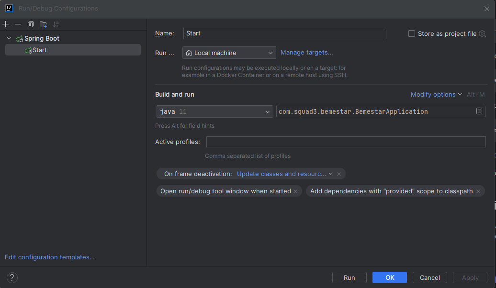

# 🧑‍💻Squad3_Projeto_Final🧑‍💻

Projeto final Catalisa

<p align="center">
</p>


# 🩺Bem Estar Zup🩺

Aplicativo que permite aos colaboradores avaliarem seu
bem-estar diariamente, de forma anônima.
O aplicativo coletará informações sobre ânimo, níveis de estresse, energia, qualidade do
sono e atividade física, de acordo com a Campanha que o Administrador desejar. Essas avaliações serão a base para criar
um perfil de bem-estar
individual, ajudando os colaboradores a entenderem melhor sua saúde mental e física.


<p align="center">
</p>

## 🏗️Stack utilizada🏗️

**Front-end:** Figma

**Back-end:** Spring Boot (Java 11)

**Banco-de-dados:** H2, Postgres

**Idea Desenvolvimento:** Intellij

## 📀Instalação e Requisitos de Sistema📀

1. Clone o repositório:

```bash
git clone https://github.com/WellZup/Squad3_Projeto_Final.git
```

2. Configure o banco de dados no arquivo `src/main/resources/application.properties` e criar o container.

```bash
docker run --name some-postgres -e POSTGRES_PASSWORD=1234 -d -p 5432:5432 postgres
```

3. Conectar no banco de dados e criar o schema.

```bash
create schema campanha;
```

4. Compile o projeto com Maven:

```bash
mvn clean install
```

5. Execute o projeto

<p>


</p>

6. Visualizar o Swagger em: http://localhost:8080/swagger-ui/index.html

## 📱Funcionalidades📱

- Permite ao Administrador criar Campanhas mensuraveis
- Mostra a media de resposta por cada Campanha criada em forma de gráfico
- Permite ao Usuário responder questionários feitos pelo Administrador

## 🗃️Documentação🗃️

- Para acessar a documentação, inicie o projeto na IDE, em seguida clique no link abaixo.

[Documentação](http://localhost:8080/swagger-ui/index.html#/)

- Para acessar o Report de testes unitários dos Controllers, clique abaixo.

[Report de Testes Unitários](https://htmlpreview.github.io/?https://github.com/WellZup/Squad3_Projeto_Final/blob/main/htmlReport_Testes_ProjetoFinal/index.html)

## Autores

- [Carlos Lack](https://www.linkedin.com/in/calj82/)
- [Hellen Thaise](https://www.linkedin.com/in/hellenthaise/)
- [Wellington Rodrigues](https://www.linkedin.com/in/wellington-rodrigues-de-oliveira-%E2%99%BF-35023181/)

<p align="center">
  
  


</p>
